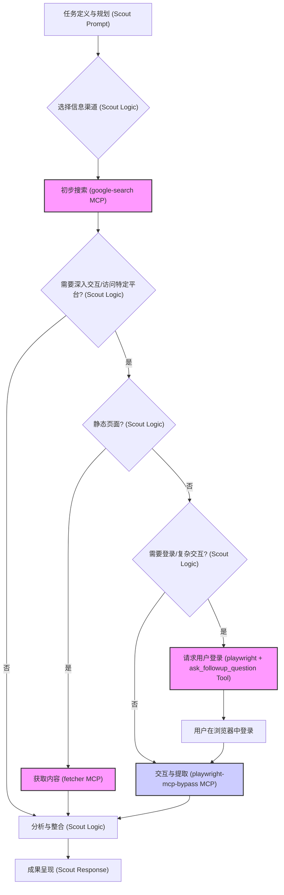

# Scout Agent (Archer) - A Web Research Agent for Roo Code

[](https://x.com/yan5xu)

Scout (代号 Archer) 是一个基于 **[Roo Code VS Code 扩展](https://marketplace.visualstudio.com/items?itemName=RooVeterinaryInc.roo-cline)** 设计的实验性 Agent 实现。它专注于通过模拟人类行为进行精准的网络信息收集、研究与交互，旨在将 Roo Code 转变为一个强大的 Web 研究助手。

## 项目目标

本项目旨在展示如何通过精心设计的 Prompt 和 MCP (Model Context Protocol) 配置，为 Roo Code 框架赋予强大的网络信息收集和深度交互能力。Scout 的核心价值在于其定义的 **Web 研究工作流** 和 **利用用户登录访问私域信息** 的能力，使得基于 LLM 的 Agent 能够突破公开信息的限制。

## 核心特点

*   **专注 Web 研究**: Scout 的设计目标是成为一个专业的网络信息收集与分析助手。
*   **纯 Prompt 工程**: Agent 的核心逻辑、工作流程和多平台策略完全通过 Prompt (`.roorules-scout`, `.roo/system-prompt-scout`) 定义，展示了在 Roo Code 框架内进行 Agent 定制的潜力。
*   **深度 Web 交互**: 利用集成的 MCP 工具，特别是增强版的 [`playwright-mcp-bypass`](https://github.com/yan5xu/playwright-mcp-bypass)（内置反检测机制），实现复杂的网页操作。
*   **访问私域信息**: **核心创新点**在于引导用户在浏览器中登录个人账号，使 Scout 能够抓取和分析需要登录才能访问的内容（如社交媒体、专业论坛的非公开帖子），显著增强信息获取能力。
*   **高性价比**: 在 `deepseek-v3` 等模型上运行时，完成一次深度搜索任务的成本效益高（约 0.1元人民币）。
*   **结构化与可溯源**: 遵循定义好的研究流程，并强调对所有关键信息标注来源 URL，确保结果的可靠性。
*   **人机协作**: 在自动化流程遇到障碍（如登录、验证码）时，能通过 Roo Code 的机制请求用户介入。

## 工作原理

Scout 通过在 Roo Code 框架内执行一系列预定义的规则和流程来工作。

**核心工作流程图:**



**流程说明:**

1.  **任务输入**: 用户在 VS Code 的 Roo Code 扩展中，切换到 `scout` 模式，并输入研究任务。
2.  **规划与搜索**: Scout 根据其 Prompt 规则，规划搜索策略，并指示 Roo Code 使用 `google-search` MCP 进行初步探索。
3.  **工具选择与执行**: 根据目标网站的类型（静态、动态、需登录），Scout 指示 Roo Code 调用 `fetcher` 或 `playwright-mcp-bypass` MCP。
4.  **交互与登录**: 对于需要登录的网站，Scout 会请求用户在 `playwright-mcp-bypass` 控制的浏览器中完成登录，随后继续执行信息提取。
5.  **分析与呈现**: Scout 整合收集到的信息，并通过 Roo Code 界面向用户报告研究结果，包含来源链接。

详细的工作流程、工具选择逻辑和平台规则定义在 `.roorules-scout` 文件中。

## 技术栈/依赖

*   **运行环境**: [Roo Code (VS Code Extension)](https://marketplace.visualstudio.com/items?itemName=RooVeterinaryInc.roo-cline)
*   **推荐 LLM**: `deepseek-v3` (或其他性能相近的模型，在 Roo Code 扩展设置中配置)
*   **MCP 工具 (需单独运行)**:
    *   `google-search-mcp`
    *   `fetcher-mcp`
    *   [`playwright-mcp-bypass`](https://github.com/yan5xu/playwright-mcp-bypass) (增强版 Playwright MCP)

## 如何开始

使用 Scout Agent 非常简单：

1.  **确保基础环境**:
    *   已安装 **VS Code**。
    *   已安装 **[Roo Code 扩展](https://marketplace.visualstudio.com/items?itemName=RooVeterinaryInc.roo-cline)** 并 **配置好 AI Provider** (如 `deepseek-v3`)。
    *   确保 `npx` 可用，并已**分别启动**以下 MCP 服务：
        *   `npx google-search-mcp`
        *   `npx -y fetcher-mcp`
        *   `npx playwright-mcp-bypass` (参考 [其仓库](https://github.com/yan5xu/playwright-mcp-bypass) 说明运行)
2.  **获取本项目**:
    ```bash
    git clone https://github.com/yan5xu/scout.git
    ```
3.  **打开项目**: 使用 VS Code 打开刚刚克隆的 `scout` 文件夹。
4.  **切换模式**: 在 Roo Code 扩展的聊天界面中，你应该能看到 `scout` 模式。切换到此模式。
5.  **开始使用**: 现在你可以向 Scout Agent 分配网络研究和信息收集任务了。

*(请确保 `.roo/mcp.json` 文件中的配置与你实际运行 MCP 服务的方式一致。)*

## 项目文件说明

这些文件是 Scout Agent 的核心配置，用于指导 Roo Code 扩展的行为：

*   `.roorules-scout`: 定义了 Scout Agent 的核心工作流程、规则、工具选择逻辑和多平台搜索策略。
*   `.roo/system-prompt-scout`: 包含了 Scout 模式的系统级 Prompt，定义了其角色、能力和 MCP 工具使用指南。
*   `.roomodes`: 定义了 `scout` 自定义模式，供 Roo Code 扩展加载。
*   `.roo/mcp.json`: 为 Roo Code 扩展配置了 Scout 所需的 MCP 服务器。

## 联系作者

*   **GitHub**: [yan5xu](https://github.com/yan5xu)
*   **Twitter**: [@yan5xu](https://x.com/yan5xu)